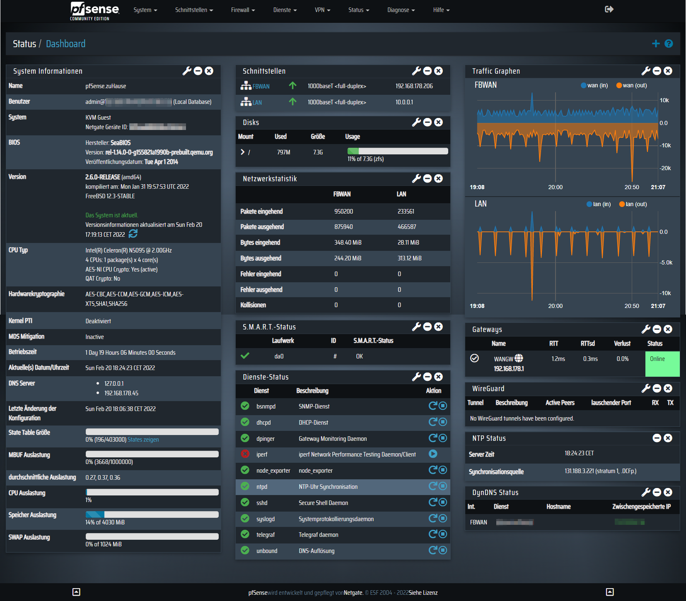

A **Dark-Grey** theme for [pfSense 2.6.0](https://github.com/pfsense/pfsense)

## Screenshots

## Install
1. Connected SSH-Console on pfSense
2. Open pfSense filesystem and copy pfSense-dark-grey-topale.css to /usr/local/www/css
3. At pfSense settings, go to System -> General Setup then choose **pfSense-dark-grey-topale** at webConfigurator section. Press 'Save' at the bottom of the page then navigate to the main page. Reload Page.

Have Fun ;-)
